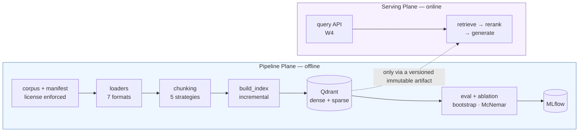

# RAG Platform — a production RAG system for Vietnamese

***English** · [Tiếng Việt](README.vi.md)*

> This started as a Streamlit RAG proof-of-concept and is being **rebuilt as a
> production platform**. The POC still runs, lives in [`legacy/`](legacy/), and is
> kept deliberately: it is the **measured baseline** every improvement below is
> compared against.
>
> Progress, engineering decisions and **every number** live in
> [`plans/CHECKLIST.md`](plans/CHECKLIST.md) · session journal in
> [`plans/WORKLOG.md`](plans/WORKLOG.md) · one report per task in
> [`plans/reports/`](plans/reports/README.md).
>
> ℹ️ Those engineering journals are written in **Vietnamese** — they are working
> documents, not marketing. This README covers what they contain.

---

## The thesis

Most RAG demos break on the way to production for the same reason: **there is no
way to tell whether a change made the system better or worse.** Change the chunk
size, swap the model, add a reranker — everything "seems better".

This repo is built on two principles, and most of the work went into the second.

**1. Two separate planes.** The *Pipeline Plane* (offline: ingestion, indexing,
evaluation, experiments) and the *Serving Plane* (online: user queries) are two
processes, two lifecycles, two dependency sets. They may only be joined through a
versioned, immutable artifact. That boundary is **enforced by a test** —
`tests/unit/test_architecture_boundaries.py` walks the AST and fails CI if
`rag_core` imports `pipeline`, or if a heavy dependency (`torch`,
`qdrant_client`) reaches the module level of the core library.

**2. No number is stated without a measurement, and no measurement is trusted
without a significance test.** Comparing two retrieval configurations is a
statistics problem, not a matter of putting two tables side by side: the repo has
paired bootstrap, McNemar, Bonferroni correction when scanning across groups, and
a distinct flag for *"not enough power to conclude"* — which is not the same
thing as *"tie"*.

---

## Status

| Phase | Done | Gate | Notes |
|---|:---:|:---:|---|
| **W0** · Setup & decisions | 1/8 | — | mostly waiting on rented GPU |
| **W1** · Foundations + eval baseline | **13/13** | 🟡 | conditional PASS — golden set was model-reviewed, not human-reviewed (`TD-13`) |
| **W2** · Retrieval upgrade | **10/10** | 🟡 | 1 criterion not yet measurable (end-to-end p95, blocked on `W4-13`) |
| **W3** · Ingestion + chunking | **7/9** | ⬜ | 2/3 gate criteria met; `W3-04` (needs GPU) and `W3-09` remain |
| **W4** · Serving Plane | 0/13 | ⬜ | not started |
| **W5** · Full eval + observability | 0/11 | ⬜ | not started |
| **W6** · Polish & presentation | 0/8 | ⬜ | not started |

**1,436 tests** — 40 unit files (no Docker required) + 11 integration files
(against real Qdrant/Redis). `ruff` and `mypy` clean across 139 files. 27
engineering reports, one per task. `tests/e2e/` and `tests/security/` are empty
scaffolding for `W5`/`W6`.

---

## Measured results

On `golden_v1` — **242 questions** whose labels are anchored to character spans in
**60 World Bank documents about Vietnam** (40 English + 20 Vietnamese, 14.3M
characters, all CC BY 3.0 IGO). 209 questions are scored for ranking; 33
`unanswerable` questions are measured separately by refusal correctness — they
return `None` on every ranking metric rather than being counted as zero.

| Metric | POC (baseline) | Current | `G6` target |
|---|---:|---:|---:|
| Recall@10 | 0.2257 | **0.7352** | ≥ 0.90 |
| Recall@5 | 0.1746 | **0.7026** | — |
| nDCG@10 | 0.1621 | **0.6481** | ≥ 0.82 |
| MRR | 0.1660 | **0.6440** | ≥ 0.75 |
| hit_rate@1 | 0.1196 | **0.5598** | — |
| p95 retrieval latency | 32.8 ms | 604.0 ms | — |

Current configuration: **BGE-M3 + hybrid RRF (`k=1`) + cross-encoder reranking
over a pool of 50**. Measured on the **same 209 questions with the same labels**,
so it is directly comparable to the baseline.

**Three things that must be read alongside that table:**

* **`cross_lingual` scores 0** at baseline because the old embedding model is
  **monolingual**. The gap to `Recall@10 ≥ 0.90` is **not** closable by parameter
  tuning.
* **`c=50` is neither the best nor the fastest configuration** — it is the one
  being reported. `c=100` scores higher, but `W2-08` measured that the gain is
  **coverage**, not ranking quality (nDCG and MAP move in the **opposite**
  direction). `c=20` keeps 91% of the gain at **233 ms** and is the recommended
  operating point.
* **604 ms is retrieval-only latency**, not end-to-end. It can only be compared
  against the 3,500 ms threshold after `W4-13`.

---

## Architecture



| Directory | Role |
|---|---|
| `packages/rag_core/` | **Core library.** Never imports `pipeline`/`serving`. Heavy dependencies are imported lazily. `chunking/` `embedding/` `loaders/` `retrieval/` `reranking/` `llm/` |
| `pipeline/` | Pipeline Plane: `corpus/` `indexing/` `goldenset/` `eval/` `experiments/` `ingest/` |
| `serving/` | Serving Plane (`W4`, not built yet) |
| `configs/` | Versioned configs for corpus / indexing / experiments |
| `plans/` | `CHECKLIST.md` (source of truth), `WORKLOG.md`, `reports/` |
| `tests/` | `unit/` (40 files) · `integration/` (11) · `e2e/`, `security/` still empty |
| `legacy/` | The Streamlit POC — the comparison baseline, still runnable |

---

## Getting started

```bash
uv sync --all-extras        # or: make install
cp .env.example .env        # fill in API keys only if generating a golden set
make up                     # Qdrant + Postgres + Redis, waits until healthy

make data-pull              # corpus via DVC (or `make corpus` to re-fetch from source)
make index BUNDLE=bgem3     # build the index
make eval-retrieval BUNDLE=bgem3 MODE=hybrid RUN=my-run
```

**The evaluation path needs no LLM API at all.** It has been run for real with
empty keys and produced results identical to the run with keys (0.0000%
deviation) — retrieval evaluation must not depend on a paid service.

```bash
make help                   # every target, with descriptions
make lint                   # ruff check + format + mypy
make test                   # unit tests, no Docker needed
make test-integration       # requires `make up`
```

### Worth trying

```bash
make index-dry BUNDLE=bgem3      # chunk a few docs, print stats, never touch Qdrant
make truncation                  # how much text the embedding model silently cuts
make token-probe                 # chunking by characters vs by tokens, on the real corpus
make incr-probe                  # edit one line → how many chunks must be re-embedded
make ablation                    # 14-cell table with per-row p-values and CIs
make ingest-api & make ingest-worker   # ingestion API + background worker
```

---

## How evaluation works

This is the part that separates the repo from a demo, so it is the part worth
reading closely.

**Labels are anchored to character spans, not to `chunk_id`.** A `chunk_id` here
is `{doc_id}::{index}` — purely positional. Change `chunk_size` and every
`chunk_id` points at a different passage, so a golden set anchored to `chunk_id`
starts measuring the wrong thing **silently** the first time anyone touches
chunking. Labels therefore anchor to **character ranges in the source document**
and are re-resolved per index.

**A label digest guards every comparison.** Each run records a
`relevant_digest`. Comparing two runs with different labels is **rejected**, not
warned about — because that is exactly how a comparison table becomes meaningless
while still looking perfectly normal.

**Significance testing, not eyeballing.** `make eval-compare` runs a **paired**
bootstrap + CI + McNemar per metric. `make eval-compare-by BY=lang` scans across
groups with **Bonferroni correction**. There are separate flags for
`INSUFFICIENT POWER` (McNemar's `p` is bounded below by `2/2ⁿ`, so a 4-question
group is permanently unmeasurable) and `INCONCLUSIVE` — both distinct from "tie",
and collapsing them together is the fastest way to misread a result.

**The integrity chain is pinned all the way to the parsed text.** The manifest
pins not just the `sha256` of the bytes but also `text_sha256` and a parser
fingerprint — including the version of **every** package that can change the
output, plus the resolved commit SHA of the layout model weights.

---

## A few decisions, with numbers

Each row links to a report containing the measurement, an explicit "what I
deliberately did not do" section, and a table of predictions written **before**
measuring, checked against the outcome.

| | Finding | Report |
|---|---|---|
| `W2-03`<br/>`W2-05` | **Subword vocabulary breaks known-item search**: 25/51 document IDs were unfindable by any branch. The reranker fixes most of it (hit@1 0.098 → 0.549) — and it **beats sparse retrieval** | [`w2-05-reranker.md`](plans/reports/tasks/w2-05-reranker.md) |
| `W2-08` | "Which configuration wins" is a **max-selection problem**, so the answer is a **set**, not a row. The winner was once decided by **6 resamples out of 10,000** | [`w2-08-ablation.md`](plans/reports/tasks/w2-08-ablation.md) |
| `W2-09` | "Which category improved most" **has no answer** with the data available — all 6 groups tie, and still tie without the correction. It needs ~440 questions | [`exp-001-retrieval.md`](plans/reports/tasks/exp-001-retrieval.md) |
| `W3-01` | Inserting a parser between bytes and text **destroys the golden set**: 0/280 spans survive, while `sha256` still matches and no test goes red | [`w3-01-docling-loader.md`](plans/reports/tasks/w3-01-docling-loader.md) |
| `W3-02` | The bundled OCR engine reads English verbatim but **returns garbage for Vietnamese** — so the loader **refuses** rather than emitting garbage that looks like content | [`w3-02-ocr-fallback.md`](plans/reports/tasks/w3-02-ocr-fallback.md) |
| `W3-06` | **Characters are not a portable unit**: for the same chunk set, switching tokenizer changes the token count by up to 47%, and the EN↔VI skew **reverses sign** | [`w3-06-token-sizing.md`](plans/reports/tasks/w3-06-token-sizing.md) |
| `W3-05` | **Context expansion ratio is a misleading metric**: halving the child doubles it while the actual prompt stays the same (9,471 → 9,519 tokens) | [`w3-05-parent-child.md`](plans/reports/tasks/w3-05-parent-child.md) |
| `TD-22` | The parser fingerprint pinned the **umbrella package name**: the function producing the text lives in `docling-core`, and the layout model weights are pulled from a **moving branch** | [`td-22-parse-pin.md`](plans/reports/tasks/td-22-parse-pin.md) |
| `W3-07` | Incremental re-indexing is **179.3× faster**; and the blast radius of an edit is bounded by the **distance to the next paragraph break** (2.0% → 98.0% reuse) | [`w3-07-incremental-reindex.md`](plans/reports/tasks/w3-07-incremental-reindex.md) |
| `W3-08` | arq's `max_tries` does **not** retry ordinary exceptions — and that default turns out to be right | [`w3-08-ingest-worker.md`](plans/reports/tasks/w3-08-ingest-worker.md) |

---

## Hard constraints

Three rules enforced in code, not by promise:

1. **No OpenRouter presets (`@preset/...`) anywhere on the evaluation path.** A
   preset is server-side configuration that can change without notice, and a
   metric that shifts for untraceable reasons is a useless metric. Always pin an
   explicit slug, `temperature=0`, a fixed seed, and **log the model that
   actually served the request**. Blocked in the LLM client's constructor.
2. **Rented GPU jobs never carry API keys.** Rented machines only run
   self-contained GPU-bound work; anything touching a paid API runs locally.
3. **The corpus must be public and redistributable.** Public repo + public demo +
   third-party rented machine = three publication channels. `LICENSE_ALLOWLIST`
   rejects any entry missing `source_url` or carrying a license outside the list
   — including `ND` (NoDerivatives), because chunking plus LLM-generated context
   **is** creating a derivative work.

---

## The original POC

The Streamlit version in [`legacy/`](legacy/) still runs and is the baseline for
every number above. Some of its bugs are documented on purpose, because they
teach something: a `pickle` cache loaded from a writable directory, a
`config_hash` that **rounded** its parameters so two different configurations
shared one cache entry, and post-processing that merged chunks **across document
boundaries**. That last bug shape reappeared twice more during `W3` — at section
boundaries and at parent boundaries.

## License

**Source code:** MIT — [`LICENSE`](LICENSE).

**The corpus is NOT under MIT** — those are World Bank documents under
**CC BY 3.0 IGO**. Details in [`data/README.md`](data/README.md). The two must be
kept separate: folding them under a single "MIT" line grants others a right I do
not hold.

- [`RUNPOD.md`](RUNPOD.md) — running the contextual-retrieval job on a rented GPU, or on an API instead
