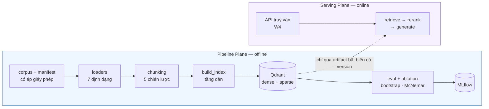

# RAG Platform — nền tảng RAG production cho tiếng Việt

> Dự án này bắt đầu từ một POC Streamlit và đang được **viết lại thành một nền
> tảng production**. Bản POC vẫn chạy được, nằm ở [`legacy/`](legacy/), và được
> giữ lại vì nó là **mốc so sánh có số đo** — mọi cải thiện dưới đây đều đo ngược
> lại nó chứ không so với cảm nhận.
>
> Tiến độ, quyết định kỹ thuật và **mọi con số** ở
> [`plans/CHECKLIST.md`](plans/CHECKLIST.md) · nhật ký phiên ở
> [`plans/WORKLOG.md`](plans/WORKLOG.md) · báo cáo từng hạng mục ở
> [`plans/reports/`](plans/reports/README.md).

---

## Luận điểm

Hầu hết demo RAG hỏng khi lên production vì cùng một lý do: **không có cách nào
biết một thay đổi làm hệ thống tốt lên hay tệ đi**. Đổi chunk size, đổi model,
thêm reranker — tất cả đều "trông có vẻ khá hơn".

Repo này dựng theo hai nguyên tắc, và phần lớn công sức nằm ở nguyên tắc thứ hai:

**1. Tách hai plane.** *Pipeline Plane* (offline: ingest, index, eval, thí
nghiệm) và *Serving Plane* (online: truy vấn của người dùng) là hai tiến trình,
hai vòng đời, hai bộ phụ thuộc. Chúng chỉ được nối với nhau qua một artifact bất
biến có version. Ranh giới này được **canh bằng test** — `tests/unit/test_architecture_boundaries.py`
quét AST và làm đỏ CI nếu `rag_core` import `pipeline`, hoặc nếu một phụ thuộc
nặng (`torch`, `qdrant_client`) lọt vào tầng module của thư viện lõi.

**2. Không con số nào được phát biểu mà không có phép đo, và không phép đo nào
được tin mà không có kiểm định.** So hai cấu hình retrieval là một bài toán thống
kê, không phải việc nhìn hai bảng cạnh nhau: repo có bootstrap có cặp, McNemar,
hiệu chỉnh Bonferroni khi quét nhiều nhóm, và cờ riêng cho *"không đủ lực để kết
luận"* — khác hẳn *"hoà"*.

---

## Trạng thái

| Giai đoạn | Xong | Gate | Ghi chú |
|---|:---:|:---:|---|
| **W0** · Chuẩn bị & quyết định | 1/8 | — | phần lớn chờ GPU thuê |
| **W1** · Nền móng + eval baseline | **13/13** | 🟡 | PASS *có điều kiện* — golden set review bằng model, chưa phải người (`TD-13`) |
| **W2** · Retrieval upgrade | **10/10** | 🟡 | 1 tiêu chí chưa đo được (p95 end-to-end, chờ `W4-13`) |
| **W3** · Ingestion + chunking | **7/9** | ⬜ | 2/3 tiêu chí đạt; còn `W3-04` (cần GPU) và `W3-09` |
| **W4** · Serving Plane | 0/13 | ⬜ | chưa bắt đầu |
| **W5** · Eval đầy đủ + observability | 0/11 | ⬜ | chưa bắt đầu |
| **W6** · Hoàn thiện & trình bày | 0/8 | ⬜ | chưa bắt đầu |

**1 436 test** — 40 file unit (không cần Docker) + 11 file integration (cần
Qdrant/Redis thật). `ruff` và `mypy` sạch trên 139 file. 27 báo cáo kỹ thuật, mỗi
hạng mục một cái. `tests/e2e/` và `tests/security/` mới là khung rỗng, dành cho
`W5`/`W6`.

---

## Kết quả đo được

Trên `golden_v1` — **242 câu** neo theo span vào **60 tài liệu World Bank về Việt
Nam** (40 tiếng Anh + 20 tiếng Việt, 14,3 triệu ký tự, toàn bộ CC BY 3.0 IGO).
209 câu chấm điểm xếp hạng; 33 câu `unanswerable` đo riêng bằng refusal
correctness — chúng trả `None` ở mọi metric xếp hạng chứ không bị tính là 0.

| Metric | POC (baseline) | Hiện tại | Mục tiêu `G6` |
|---|---:|---:|---:|
| Recall@10 | 0,2257 | **0,7352** | ≥ 0,90 |
| Recall@5 | 0,1746 | **0,7026** | — |
| nDCG@10 | 0,1621 | **0,6481** | ≥ 0,82 |
| MRR | 0,1660 | **0,6440** | ≥ 0,75 |
| hit_rate@1 | 0,1196 | **0,5598** | — |
| p95 truy hồi | 32,8 ms | 604,0 ms | — |

Cấu hình hiện tại: **BGE-M3 + hybrid RRF (`k=1`) + cross-encoder rerank trên pool
50**. Đo trên **cùng 209 câu và cùng nhãn**, nên so trực tiếp được với baseline.

**Ba điều phải đọc kèm bảng trên:**

* **`cross_lingual` đang bằng 0** ở baseline vì model embedding cũ là **đơn ngữ**.
  Khoảng cách tới `Recall@10 ≥ 0,90` **không** lấp được bằng tinh chỉnh tham số.
* **`c=50` không phải cấu hình tốt nhất cũng không phải nhanh nhất** — nó là cấu
  hình được báo cáo. `c=100` cao điểm hơn nhưng `W2-08` đo ra phần tăng đó là
  **vùng phủ**, không phải chất lượng xếp hạng (nDCG và MAP **trái chiều**).
  `c=20` giữ 91% mức lợi với **233 ms** và là điểm vận hành khuyến nghị.
* **604 ms là độ trễ truy hồi thuần**, không phải end-to-end. Ngưỡng 3 500 ms chỉ
  so được sau `W4-13`.

---

## Kiến trúc



| Thư mục | Vai trò |
|---|---|
| `packages/rag_core/` | **Thư viện lõi.** Không import `pipeline`/`serving`. Phụ thuộc nặng import lazy. `chunking/` `embedding/` `loaders/` `retrieval/` `reranking/` `llm/` |
| `pipeline/` | Pipeline Plane: `corpus/` `indexing/` `goldenset/` `eval/` `experiments/` `ingest/` |
| `serving/` | Serving Plane (`W4`, chưa dựng) |
| `configs/` | Config có version cho corpus / indexing / experiment |
| `plans/` | `CHECKLIST.md` (nguồn sự thật), `WORKLOG.md`, `reports/` |
| `tests/` | `unit/` (40 file) · `integration/` (11) · `e2e/`, `security/` còn rỗng |
| `legacy/` | POC Streamlit — mốc so sánh, vẫn chạy được |

---

## Bắt đầu

```bash
uv sync --all-extras        # hoặc: make install
cp .env.example .env        # điền API key nếu cần sinh golden set
make up                     # Qdrant + Postgres + Redis, đợi tới khi healthy

make data-pull              # corpus qua DVC (hoặc `make corpus` để tải lại từ nguồn)
make index BUNDLE=bgem3     # build index
make eval-retrieval BUNDLE=bgem3 MODE=hybrid RUN=thu-nghiem
```

**Đường eval không cần LLM API nào.** Đã chạy thật với key rỗng và kết quả trùng
khít lượt có key (sai số 0,0000%) — retrieval eval không được phép phụ thuộc vào
một dịch vụ trả tiền.

```bash
make help                   # toàn bộ target, có mô tả
make lint                   # ruff check + format + mypy
make test                   # unit test, không cần Docker
make test-integration       # cần `make up`
```

### Vài lệnh đáng thử

```bash
make index-dry BUNDLE=bgem3      # chunk thử, in thống kê, không chạm Qdrant
make truncation                  # bao nhiêu text bị model embedding cắt mất
make token-probe                 # chunk theo ký tự vs theo token, trên corpus thật
make incr-probe                  # sửa một dòng → phải embed lại bao nhiêu
make ablation                    # bảng 14 ô, có p-value và CI từng dòng
make ingest-api & make ingest-worker   # API ingestion + worker nền
```

---

## Eval hoạt động thế nào

Đây là phần khiến repo này khác một demo, nên nó đáng được đọc kỹ nhất.

**Nhãn neo theo span, không theo `chunk_id`.** `chunk_id` ở đây là
`{doc_id}::{index}` — thuần vị trí. Đổi `chunk_size` là mọi `chunk_id` trỏ sang
đoạn văn khác, nên một golden set neo theo `chunk_id` sẽ **âm thầm** đo sai ngay
lần đầu ai đó chỉnh chunking. Nhãn vì thế neo vào **khoảng ký tự trong tài liệu
gốc** và được ánh xạ lại cho từng index.

**Hàng rào băm nhãn.** Mỗi lần chạy ghi `relevant_digest`. So hai lần chạy có
nhãn khác nhau bị **từ chối**, không phải cảnh báo — vì đó đúng là cách một bảng
so sánh trở nên vô nghĩa mà vẫn trông bình thường.

**Kiểm định, không phải mắt thường.** `make eval-compare` cho bootstrap **có cặp**
+ CI + McNemar trên từng metric. `make eval-compare-by BY=lang` quét theo nhóm và
**hiệu chỉnh Bonferroni**. Có cờ riêng cho `KHÔNG ĐỦ LỰC` (trần `p` của McNemar
là `2/2ⁿ`, nên nhóm 4 câu là vĩnh viễn không đo được) và `KHÔNG KẾT LUẬN` — cả
hai khác hẳn "hoà", và gộp chúng lại là cách nhanh nhất để đọc sai kết quả.

**Chuỗi toàn vẹn ghim tới tận văn bản đã parse.** Manifest không chỉ ghim
`sha256` của byte mà cả `text_sha256` và vân tay parser — kèm version của **mọi**
gói có thể đổi văn bản xuất ra, và commit SHA của trọng số model layout.

---

## Vài quyết định có số đo

Mỗi dòng dẫn tới một báo cáo có phép đo, phần "cố ý không làm", và bảng dự đoán
ghi **trước** khi đo đối chiếu với kết quả.

| | Phát hiện | Báo cáo |
|---|---|---|
| `W2-03`<br/>`W2-05` | Vocab **subword** phá known-item search: 25/51 mã tài liệu không nhánh nào tìm ra. Reranker sửa được phần lớn (hit@1 0,098 → 0,549) — nó **thắng cả sparse** | [`w2-05-reranker.md`](plans/reports/tasks/w2-05-reranker.md) |
| `W2-08` | "Cấu hình nào thắng" là một **phép chọn cực đại**, nên câu trả lời là một **tập**, không phải một dòng. Người thắng từng do **6 mẫu lại trên 10 000** quyết định | [`w2-08-ablation.md`](plans/reports/tasks/w2-08-ablation.md) |
| `W2-09` | Câu "category nào cải thiện nhiều nhất" **không có câu trả lời** với dữ liệu hiện có — cả 6 nhóm hoà, và vẫn hoà khi bỏ hiệu chỉnh. Cần ~440 câu | [`exp-001-retrieval.md`](plans/reports/tasks/exp-001-retrieval.md) |
| `W3-01` | Chèn parser vào giữa byte và văn bản **giết sạch golden set**: 0/280 span sống sót, trong khi `sha256` vẫn khớp và không test nào đỏ | [`w3-01-docling-loader.md`](plans/reports/tasks/w3-01-docling-loader.md) |
| `W3-02` | Máy OCR đi kèm đọc tiếng Anh nguyên văn nhưng **trả rác cho tiếng Việt** — nên loader **từ chối** thay vì trả rác trông như nội dung | [`w3-02-ocr-fallback.md`](plans/reports/tasks/w3-02-ocr-fallback.md) |
| `W3-06` | **Ký tự không phải đơn vị mang đi được**: cùng một bộ chunk, đổi tokenizer là đổi số token tới 47%, và chiều lệch EN↔VI **đảo dấu** | [`w3-06-token-sizing.md`](plans/reports/tasks/w3-06-token-sizing.md) |
| `W3-05` | **Độ nở ngữ cảnh là chỉ số đánh lừa**: chia đôi child làm nó gấp đôi trong khi prompt thật không đổi (9 471 → 9 519 token) | [`w3-05-parent-child.md`](plans/reports/tasks/w3-05-parent-child.md) |
| `TD-22` | Vân tay parser ghim **tên gói ô dù**: hàm sinh ra văn bản sống ở `docling-core`, và trọng số model bố cục tải theo nhánh **di động** | [`td-22-parse-pin.md`](plans/reports/tasks/td-22-parse-pin.md) |
| `W3-07` | Re-index tăng dần **179,3×**; và thiệt hại của một lần sửa bị chặn bởi **khoảng cách tới dấu xuống dòng đoạn kế tiếp** (2,0% → 98,0%) | [`w3-07-incremental-reindex.md`](plans/reports/tasks/w3-07-incremental-reindex.md) |
| `W3-08` | `max_tries` của arq **không** thử lại `Exception` thường — và mặc định ấy hoá ra đúng | [`w3-08-ingest-worker.md`](plans/reports/tasks/w3-08-ingest-worker.md) |

---

## Ràng buộc cứng

Ba quy tắc được thực thi bằng code, không phải bằng lời hứa:

1. **Không dùng OpenRouter preset (`@preset/...`) ở bất kỳ đâu trong đường eval.**
   Preset là config phía server, đổi ngầm được, và một metric dịch chuyển không
   truy được nguyên nhân là một metric vô dụng. Luôn pin slug tường minh,
   `temperature=0`, seed cố định, và **log lại model thực tế đã phục vụ request**.
   Chặn ngay ở constructor của LLM client.
2. **Job GPU thuê không mang API key.** Máy thuê chỉ chạy việc GPU-bound tự chứa;
   mọi thứ chạm API trả tiền chạy ở máy cá nhân.
3. **Corpus phải công khai và giấy phép cho phép redistribute.** Repo public +
   demo public + máy thuê bên thứ ba = ba kênh công bố dữ liệu. `LICENSE_ALLOWLIST`
   từ chối entry thiếu `source_url` hoặc mang giấy phép ngoài danh sách — kể cả
   `ND` (NoDerivatives), vì chunking + sinh context bằng LLM **là** tạo tác phẩm
   phái sinh.

---

## POC gốc

Bản Streamlit ở [`legacy/`](legacy/) vẫn chạy được và là mốc so sánh cho mọi con
số ở trên. Vài lỗi của nó được ghi lại có chủ ý vì chúng dạy được điều gì đó:
cache `pickle` nạp từ thư mục ghi được, `config_hash` **làm tròn** tham số nên
hai cấu hình khác nhau dùng chung cache entry, và hậu xử lý gộp chunk **qua ranh
giới tài liệu**. Hình dạng lỗi cuối cùng ấy còn xuất hiện thêm hai lần nữa trong
`W3` — ở ranh giới section và ranh giới parent.

## License

**Mã nguồn:** MIT — [`LICENSE`](LICENSE).

**Corpus KHÔNG thuộc phạm vi MIT** — tài liệu World Bank theo **CC BY 3.0 IGO**.
Chi tiết ở [`data/README.md`](data/README.md). Hai thứ này phải tách bạch: gộp
chúng dưới một dòng "MIT" là cấp cho người khác một quyền mình không có.
